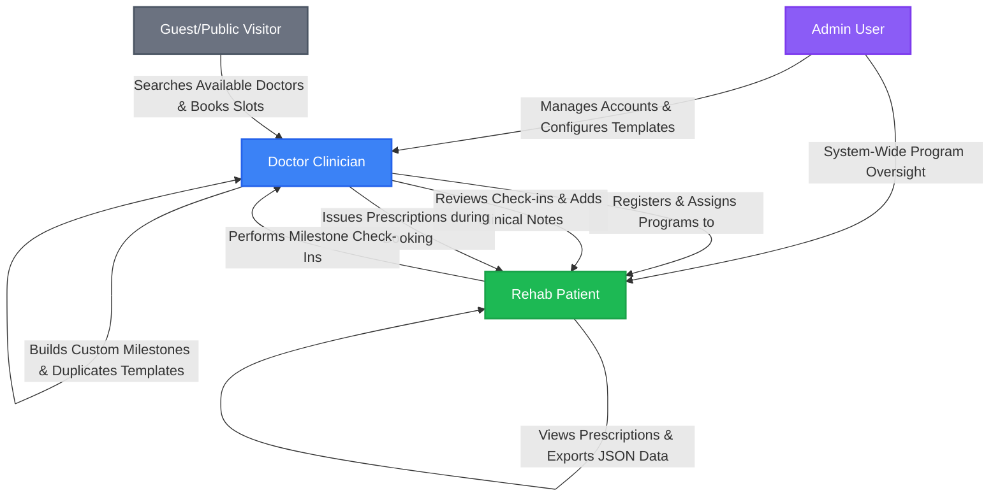

# 🚀 RecoverIQ — Premium Rehabilitation & Care Ecosystem

[](https://laravel.com)
[](https://spotify.com)
[](#-api-endpoint-matrix)

**RecoverIQ** is a premium, clinical-grade rehabilitation platform engineered to seamlessly connect patients with healthcare providers. Adopting a state-of-the-art **Spotify-inspired dark mode UI**, the platform elevates patient engagement and streamlines clinical management through highly specialized, role-based workflows for Patients, Doctors, and Administrators.

This master document serves as the **single source of truth** for the entire ecosystem, covering the unified architecture, directory trees, relational database configurations, full API endpoint matrix, frontend styling standards, quick-start guides, and developer sandbox credentials.

---

## 🗺️ System Architecture & Workflow

RecoverIQ utilizes a decoupled, high-performance architecture:
1.  **Backend Server:** A secure **Laravel 11 REST API** powered by **Sanctum stateful authentication**, role-based middleware guards, and robust mail notifications.
2.  **Frontend Client:** A lightning-fast **React 18** client built on **Vite**, **TailwindCSS**, and **TanStack React Query** (v5) for real-time state synchronization and caching.

### 🔄 Multi-Role Collaborative Workflow


### 📡 Decoupled Client-Server Communication
*   **Request Interceptors:** Custom Axios instances append active `Bearer <token>` headers from `localStorage` on every request.
*   **Response Interceptors:** Captures `401 Unauthorized` responses to instantly wipe stale tokens, clear active memory states, and securely redirect users back to the auth gateway.
*   **TanStack Query State Sync:** Leverages key-based cache invalidation to instantly refresh dashboard widgets, review tables, and appointment lists on user updates without reloading page structures.

---

## ⚡ Core Features & Domain Workflows

### 🎯 1. Interactive Patient Portal
*   **Spotify-Inspired Home Dashboard:** Immersive, motivational environment featuring circular active program trackers, recovery metrics, consistency ratings, and elapsed rehabilitation days.
*   **Daily Log Check-in & Symptom Tracker (`PatientDailyLog`):** Complete symptom logger letting patients log pain levels (1-10), energy levels, mobility scores, physical activity completion percentages, active moods, experienced difficulties, and noticeable improvements.
*   **Milestone Recovery Timeline:** A beautiful vertical timeline representing active milestones. Patients perform check-ins directly on the timeline, writing check-in notes and verifying their exercise status.
*   **Integrated Prescription Hub:** View medical prescriptions issued by assigned doctors, review diagnosis logs, and download full prescription datasets locally as formatted JSON files.
*   **Dynamic Booking System:** Request real-time appointments with assigned doctors based on their dynamic availability slots.
*   **Real-Time Notifications:** Event-driven in-app notifications (such as reviews added by doctors, appointment confirmations, and milestone approvals) with an unread badge indicator.

### 👨‍⚕️ 2. Clinician & Doctor Workspace
*   **Assigned Patient Matrix:** A comprehensive dashboard grid detailing assigned patient profiles, active programs, elapsed rehabilitation days, and overall completion percentages.
*   **Custom Program & Milestone Builder:** Dynamically design customized rehabilitation templates (15/30/60/90 days), add custom program milestones, and instantly duplicate templates (`POST /programs/{id}/duplicate`) to tailor therapies.
*   **Milestone Verification & Review Loop:** Evaluate and review patient milestone check-in submissions. Doctors can approve status updates and append actionable clinical feedback (`doctor_notes`) that instantly syncs to the patient's notifications and timeline.
*   **Prescription Engine:** Formulate precise prescriptions during or post-appointment directly inside the dashboard. Supports adding multiple prescription medicines containing specific names, dosage configurations, instruction guidelines, and duration constraints.
*   **Private Clinical Notes Ledger:** A secure tab in the patient drawer to add private clinician notes (`DoctorPatientNote`) that are excluded from the patient's view, perfect for tracking longitudinal recovery observations.
*   **Comprehensive Practice Analytics:** Monitor overall caseloads, check-in completion ratios, pending appointment requests, and patient reviews via interactive dashboard widgets.

### 🛡️ 3. Enterprise Admin Control Panel
*   **System-Wide User CRUD:** Full access to create, edit, deactivate, or delete Administrator, Doctor, and Patient accounts with rigorous format validation.
*   **Global Rehabilitation Templates:** Design standard rehabilitation templates (15, 30, 60, or 90 days) distributed as base templates for clinicians.
*   **Global Appointment Ledger:** Track and manage all platform bookings, with capabilities to override or cancel appointments in emergency situations.
*   **System Telemetry & Reports:** High-level counts of active users, active rehab programs, pending bookings, and overall platform success metrics.

### 🌐 4. Guest Portal (Public Page)
*   **Doctor Directory:** Search, discover, and filter platform doctors.
*   **Guest Appointment Booking:** Book direct consultations by selecting a doctor, choosing an available slot, and completing guest details without requiring registration.

---

## 💻 Technical Stack

| Layer | Technology | Key Libraries / Features |
| :--- | :--- | :--- |
| **Frontend** | React 18 (Vite) | React Router DOM, React Query (TanStack), Axios Interceptors, Lucide Icons, Date-fns, Recharts (Caseload & Progress Visualization), TailwindCSS |
| **Backend** | Laravel 11 | Sanctum Authentication, Spatie Roles & Permissions, Eloquent ORM, Mailgun Mailer SDK, Mailables, Resource Controllers |
| **Database** | MySQL / SQLite | SoftDeletes, Relational Migrations, Database Seeding |
| **UI Design** | Spotify Dark Mode | Theme Colors: HSL Tailored Green (`#1DB954`), Card Bg (`#181818`, `#282828`), Background (`#121212`) |

---

## 🎨 UI Design System & Styling System

The application relies on customized color systems defined under `client/src/index.css` and configured within `client/tailwind.config.js` to deliver an aesthetic premium Spotify theme:

```css
:root {
  --primary: #1db954;          /* Spotify Green primary accent */
  --primary-hover: #1aa34a;    /* Darkened green accent */
  --bg-base: #121212;          /* Immersive page base background */
  --bg-surface: #181818;       /* Primary card surface */
  --bg-surface-elevated: #282828; /* Elevated popups/drawers */
  --text-base: #ffffff;        /* Vibrant headers */
  --text-soft: #b3b3b3;        /* Muted paragraph texts */
  --border-muted: #2a2a2a;     /* Grid separator boarder */
}
```

*   **Borders & Rounding:** Highly rounded configurations (`lg: 12px`, `md: 8px`, `sm: 6px`) to ensure modern look-and-feel.
*   **Hover states:** High micro-interaction states across buttons and clickable items (scale adjustments, opacity shifts, and HSL highlights).

---

## 🗄️ Database Architecture & Eloquent Relations

RecoverIQ maps real-world medical connections into relational tables:

```text
User ──── HasOne ───> Doctor ──── HasMany ───> Patient (Assigned Case)
User ──── HasOne ───> Patient <── HasMany ─── AuthoredReviews (DoctorReview)
                               <── HasMany ─── Prescriptions (Prescription)
                               <── HasMany ─── DailyLogs (PatientDailyLog)
                               <── HasMany ─── ProgressRecords (PatientProgress)
```

### 📋 Main Eloquent Entities & Key Schema Attributes:
*   **User:** ID, Name, Email, Password, Active Flag, and `role` (`admin` | `doctor` | `patient`).
*   **Doctor:** ID, User ID, Specialization, Biography.
*   **Patient:** ID, User ID, Doctor ID (clinician assigned), Program ID (enrolled recovery track), Enrolled Date.
*   **RehabProgram:** ID, Name, Duration Days (15, 30, 60, or 90 days options), Description.
*   **ProgramMilestone:** ID, Program ID, Title, Description, Due Day (target day relative to program start).
*   **PatientProgress:** ID, Patient ID, Milestone ID, Completed Date, Status (`Pending` | `Completed`), Notes.
*   **PatientDailyLog:** ID, Patient ID, Milestone ID, Progress ID, Pain Level (1-10), Energy Level (1-10), Mobility Score (1-10), Exercise Completion percentage, Mood logs, Physical Difficulties, Physical Improvements.
*   **Prescription:** ID, Appointment ID, Doctor ID, Patient ID, Diagnosis details, Clinical Notes, Next Visit Date.
*   **PrescriptionMedicine:** ID, Prescription ID, Drug Name, Dosage rules, Duration Days, Instructions.
*   **Appointment:** ID, Patient ID (nullable), Doctor ID, Slot Date, Booked By Name, Booked By Email, Status (`pending` | `confirmed` | `completed` | `cancelled`), Notes.
*   **DoctorPatientNote:** ID, Doctor ID, Patient ID, Clinician Note, Saved Date.

---

## 📁 Project Directory Tree

```text
recover/
├── client/                     # React 18 Frontend
│   ├── src/
│   │   ├── components/         # Reusable UI & Feature components
│   │   │   ├── doctor/         # AssignProgramModal, CreateProgramModal, PatientDetailDrawer, etc.
│   │   │   ├── landing/        # Hero, Features, Social proof, CTAs
│   │   │   ├── layout/         # Sidebar, Navbar, and general wrapper structures
│   │   │   ├── shared/         # MetricCard, MilestoneTimeline, RecoveryCharts, check-in dialogs
│   │   │   └── ui/             # Core UI components (Buttons, Alerts, ProgressBars, Select, Modal)
│   │   ├── pages/              # Role-Based Feature Pages
│   │   │   ├── auth/           # Login, Password Reset
│   │   │   ├── doctor/         # Dashboard, Patients, Appointments, Programs, Milestones, Profile
│   │   │   ├── patient/        # Dashboard, RecoveryProgram, Milestones, Daily Timeline, Settings
│   │   │   └── public/         # LandingPage, Doctor Discovery, Public Booking
│   │   ├── lib/
│   │   │   └── api.js          # Unified API Service (patientApi, doctorApi Axios Client)
│   │   └── context/
│   │       └── AuthContext.jsx # Global Authentication State
│   │
│   ├── package.json            # Node dependencies
│   ├── vite.config.js          # Vite build config
│   └── tailwind.config.js      # Tailwind customization config
│
└── server/                     # Laravel 11 API Backend
    ├── app/
    │   ├── Http/Controllers/Api/ # Domain-Specific API Controllers
    │   │   ├── Admin/          # UserController, ProgramController, ReportController
    │   │   ├── Auth/           # AuthController, ForgotPasswordController
    │   │   ├── Doctor/         # PatientNotes, Prescription, Analytics, Milestone, etc.
    │   │   └── Patient/        # Dashboard, Progress, Analytics, Prescription, etc.
    │   ├── Models/             # Database Models (User, Patient, Doctor, DailyLog, etc.)
    │   └── Mail/               # PatientCredentialsMail & AppointmentConfirmationMail
    ├── database/
    │   ├── migrations/         # Relational DB Schema migrations
    │   └── seeders/            # Database Seeders (Roles, Admin, Programs)
    ├── routes/
    │   └── api.php             # Unified Sanctum API Routes
    ├── config/                 # Laravel system configurations
    └── .env                    # Backend environment config
```

---

## 🔒 API Endpoint Matrix

All endpoints are prefixed with `/api`. Authenticated endpoints require a `Bearer <token>` authorization header.

### 🔑 Authentication (Public & Shared)
| Method | Endpoint | Auth | Description |
| :--- | :--- | :---: | :--- |
| `POST` | `/auth/login` | None | Authenticate user (Admin/Doctor/Patient), returns Sanctum token |
| `POST` | `/auth/register-doctor` | None | Register a new doctor account |
| `POST` | `/auth/forgot-password` | None | Send password reset link to user's registered email |
| `POST` | `/auth/reset-password` | None | Complete password reset (token verification) |
| `POST` | `/auth/logout` | Sanctum | Revoke current authenticated session token |
| `POST` | `/auth/reset-password` | Sanctum | Self-service password change for logged-in users |

### 🌐 Public Portal (No Auth)
| Method | Endpoint | Description |
| :--- | :--- | :--- |
| `GET` | `/doctors` | Fetch list of registered doctors |
| `GET` | `/doctors/{id}/slots` | Fetch available appointment slots for a doctor |
| `POST` | `/appointments/public` | Book a consultation slot as an unregistered guest |

### 🛡️ Administrator Operations (`role:admin`)
| Method | Endpoint | Description |
| :--- | :--- | :--- |
| `GET` | `/admin/users` | List all platform users (paginated) |
| `POST` | `/admin/users` | Register a new doctor/admin directly |
| `PATCH` | `/admin/users/{id}` | Update details or toggle active status of a user |
| `DELETE` | `/admin/users/{id}` | Permanently delete a user |
| `GET` | `/admin/programs` | List all global rehabilitation templates |
| `POST` | `/admin/programs` | Create a new standard program (15/30/60/90 days) |
| `PATCH` | `/admin/programs/{id}` | Update program template configurations |
| `DELETE` | `/admin/programs/{id}` | Remove program template |
| `GET` | `/admin/appointments` | Monitor all platform bookings |
| `PATCH` | `/admin/appointments/{id}` | Cancel/update any appointment |
| `GET` | `/admin/reports` | View global telemetry, patient metrics & system insights |

### 👨‍⚕️ Doctor Operations (`role:doctor`)
| Method | Endpoint | Description |
| :--- | :--- | :--- |
| `GET` | `/doctor/dashboard-summary` | Caseload metrics, pending bookings, and patient review metrics |
| `GET` | `/doctor/patients` | Fetch list of assigned patients |
| `POST` | `/doctor/patients` | Register patient and auto-send invitation credentials email |
| `GET` | `/doctor/patients/{id}` | Fetch patient details, daily logs, and active progress |
| `GET` | `/doctor/patients/{id}/notes` | Fetch private clinical notes |
| `POST` | `/doctor/patients/{id}/notes` | Save a private clinical note (`DoctorPatientNote`) |
| `GET` | `/doctor/appointments` | Fetch doctor's calendar bookings |
| `GET` | `/doctor/appointments-counts` | Fetch real-time pending vs. confirmed booking tallies |
| `PATCH` | `/doctor/appointments/{id}` | Confirm, cancel, or complete an appointment |
| `POST` | `/doctor/appointments/{id}/prescription` | Issue a prescription (diagnosis, meds, schedule) |
| `POST` | `/doctor/reviews` | Write patient reviews |
| `GET` | `/doctor/reviews/{patientId}` | Fetch reviews issued for a specific patient |
| `GET` | `/doctor/programs` | Fetch available program templates |
| `POST` | `/doctor/programs` | Create a customized clinician template |
| `GET` | `/doctor/programs/{id}` | Fetch specific program with attached milestone list |
| `PATCH` | `/doctor/programs/{id}` | Update clinician program settings |
| `DELETE` | `/doctor/programs/{id}` | Delete customized template |
| `POST` | `/doctor/programs/{id}/duplicate` | Duplicate an existing program template |
| `POST` | `/patients/{patientId}/assign-program` | Assign program template to patient |
| `GET` | `/doctor/milestones` | Fetch all milestones across active caseloads |
| `POST` | `/programs/{id}/milestones` | Append a milestone to a program |
| `PATCH` | `/doctor/milestones/{id}` | Update milestone parameters |
| `DELETE` | `/doctor/milestones/{id}` | Remove milestone from program |
| `PATCH` | `/doctor/milestones/review/{progressId}` | Review/Approve a check-in and add `doctor_notes` |
| `GET` | `/doctor/analytics` | Fetch practice caseload statistics & progress reports |
| `GET` | `/doctor/profile` | Fetch doctor profile details |
| `PUT` | `/doctor/profile` | Update profile information |

### 🎯 Patient Operations (`role:patient`)
| Method | Endpoint | Description |
| :--- | :--- | :--- |
| `GET` | `/patient/dashboard` | Active program details, timeline status, and counts |
| `GET` | `/patient/feedback` | Get personalized clinical feedback & recommendations |
| `GET` | `/patient/recovery-program` | Detailed breakdown of currently assigned program |
| `GET` | `/patient/analytics` | View personal rehabilitation progress trends (pain, compliance) |
| `GET` | `/patient/milestones` | Fetch milestones for active program |
| `POST` | `/patient/milestones/{id}/check-in` | Perform milestones check-in (submit notes & pain status) |
| `POST` | `/patient/progress` | Submit daily log progress check-in |
| `GET` | `/patient/progress` | View history of daily progress logs |
| `GET` | `/patient/appointments` | Fetch personal appointments list |
| `POST` | `/patient/appointments` | Request an appointment slot with assigned doctor |
| `GET` | `/patient/prescriptions` | List all prescriptions issued by doctor |
| `GET` | `/patient/prescriptions/{id}` | Fetch a detailed prescription page |
| `GET` | `/patient/reviews` | View doctor reviews and therapeutic advice |
| `GET` | `/patient/notifications` | Fetch unread in-app alert feeds |
| `PATCH` | `/patient/notifications/{id}/read` | Dismiss notification / Mark as read |

---

## 🚀 Step-by-Step Installation Guide

Follow these steps to launch the entire RecoverIQ stack locally.

### 📋 Prerequisites
*   **PHP** 8.2 or higher
*   **Composer**
*   **Node.js** v18+ & **npm**
*   **MySQL** database server

---

### 📦 1. Backend Setup (Laravel)

1.  **Navigate into the server directory:**
    ```bash
    cd server
    ```
2.  **Install PHP packagist dependencies:**
    ```bash
    composer install
    ```
3.  **Setup your environment configuration:**
    ```bash
    cp .env.example .env
    ```
4.  **Configure environment values:**
    Open the newly created `.env` file and set up database variables matching your SQL server settings:
    ```env
    DB_CONNECTION=mysql
    DB_HOST=127.0.0.1
    DB_PORT=3306
    DB_DATABASE=recoveriq
    DB_USERNAME=root
    DB_PASSWORD=
    
    SANCTUM_STATEFUL_DOMAINS=localhost:5173
    FRONTEND_URL=http://localhost:5173
    ```
5.  **Generate application unique security key:**
    ```bash
    php artisan key:generate
    ```
6.  **Run migrations and seed default data:**
    This command builds the active schema tables and seeds initial user roles, admin profiles, doctors, patients, and global rehabilitation templates:
    ```bash
    php artisan migrate:fresh --seed
    ```
7.  **Run backend API server:**
    ```bash
    php artisan serve
    ```
    *The backend server will run at: `http://localhost:8000`*

---

### 💻 2. Frontend Setup (React)

1.  **Navigate into the client directory:**
    ```bash
    cd ../client
    ```
2.  **Install node modules:**
    ```bash
    npm install
    ```
3.  **Setup environment variables:**
    ```bash
    cp .env.example .env
    ```
    Ensure that `VITE_API_URL` correctly targets your active Laravel server api instance:
    ```env
    VITE_API_URL=http://localhost:8000/api
    ```
4.  **Start development server:**
    ```bash
    npm run dev
    ```
    *The frontend will boot up and remain accessible at: `http://localhost:5173`*

---

## 🔐 Sandbox Login Credentials

The database seeder configures standard sandbox accounts to enable instant role-based testing:

| Role | Username / Email | Password | Features Accessible |
| :--- | :--- | :--- | :--- |
| **Administrator** | `admin@recoveriq.com` | `password` | User CRUD, Global templates, Platform-wide booking ledger |
| **Doctor** | `doctor@recoveriq.com` | `password` | Caseload matrix, Milestone reviews, Clinical Notes, Prescriptions builder |
| **Patient** | `patient@recoveriq.com` | `password` | Daily logs check-in, Timeline check-ins, Prescription downloads, Chat |

---

## 📧 Mail Notifications Configuration

RecoverIQ handles automated outreach workflows:
*   **Patient Credentials Email:** Dispatched when a clinician registers a new patient. Auto-generates their temporary login credentials and password reset link.
*   **Appointment Confirmation Email:** Sent automatically upon guest booking confirmations or status overrides.

---

## ⚡ Troubleshooting & Common Solutions

*   **CORS Error**
    *   *Symptom:* API requests fail with CORS/Origin policy block warnings.
    *   *Solution:* Open `server/.env` and verify that `SANCTUM_STATEFUL_DOMAINS` matches Vite's active hostname (`localhost:5173`) and that `FRONTEND_URL` is set exactly to the client's URL.
*   **Database Out of Sync**
    *   *Symptom:* Patient progress or dashboard statistics display empty or invalid relations.
    *   *Solution:* Reset your local schema state by executing `php artisan migrate:fresh --seed` in the server root.
*   **Token Refresh issue**
    *   *Symptom:* Dashboard pages fail with `401 Unauthorized` responses even after entering correct keys.
    *   *Solution:* Clear browser cache or locally stored parameters via Javascript DevTools Console (`localStorage.clear()`), then restart your login sequence.
